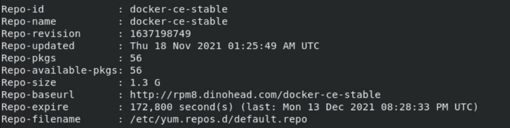
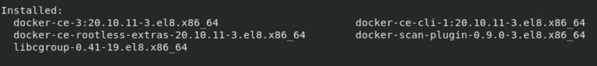
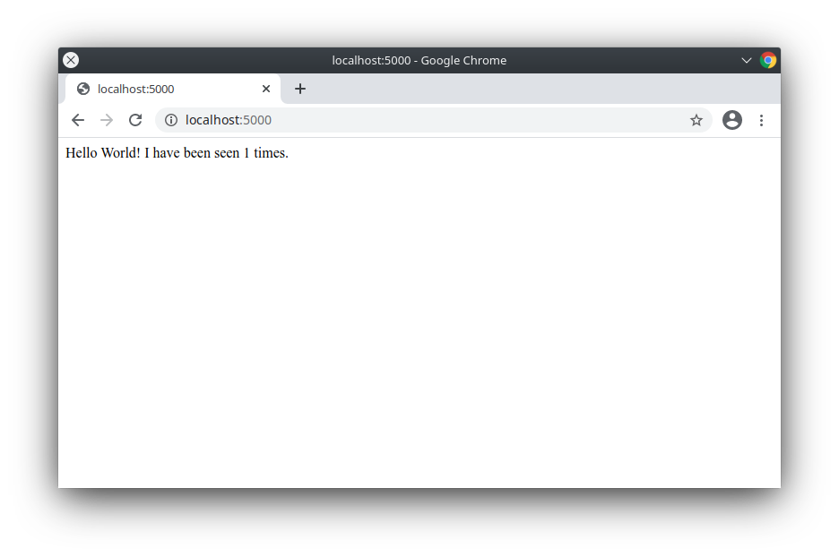
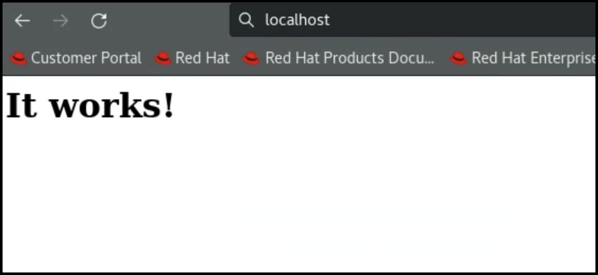

# Cloud Native Application 101


## Agenda

* Software Utilized
  * RHEL 8
  * DNF
  * The Docker Platform
  * DinoForce "Sec" Platform
* Hands-on Lab
  * Docker Engine
    * Installation and Configuration
    * Docker Admin Commands
  * Docker Compose
    * Installation and Configuration
    * Hello World
    * Commands
  * Deploy Simple Web Server
  * Deploy 2 Applications from the DinoForce "Sec" Platform


## RHEL 8

[Red Hat Enterprise Linux 8](https://www.redhat.com/en/enterprise-linux-8/details)
gives organizations a consistent OS across public, private, and hybrid cloud
environments. It provides version choice, long life-cycle commitments, a robust
ecosystem of certified hardware, software, and cloud partners, and now comes
with built-in management and predictive analytics.

Documentation: https://access.redhat.com/documentation/en-us/red_hat_enterprise_linux/8


## DNF

[DNF](https://docs.fedoraproject.org/en-US/quick-docs/dnf/) is a software
package manager that installs, updates, and removes packages on Fedora and is
the successor to **YUM** (Yellow-Dog Updater Modified). DNF makes it easy to
maintain packages by automatically checking for dependencies and determines the
actions required to install packages. This method eliminates the need to
manually install or update the package, and its dependencies, using the `rpm`
command. DNF is now the default software package management tool in Fedora.


## The Docker Platform

Docker is an open platform for developing, shipping, and running applications.
Docker enables you to separate your applications from your infrastructure so
you can deliver software quickly. With Docker, you can manage your
infrastructure in the same ways you manage your applications. By taking
advantage of Docker's methodologies for shipping, testing, and deploying code
quickly, you can significantly reduce the delay between writing code and
running it in production.

Docker provides the ability to package and run an application in a loosely
isolated environment called a container. The isolation and security allow you
to run many containers simultaneously on a given host. Containers are
lightweight and contain everything needed to run the application, so you do not
need to rely on what is currently installed on the host. You can easily share
containers while you work, and be sure that everyone you share with gets the
same container that works in the same way.

Docker provides tooling and a platform to manage the lifecycle of your
containers:

* Develop your application and its supporting components using containers.
* The container becomes the unit for distributing and testing your application.
* When you're ready, deploy your application into your production environment,
  as a container or an orchestrated service. This works the same whether your
  production environment is a local data center, a cloud provider, or a hybrid
  of the two.


## What can I use Docker for 1?

### Fast, consistent delivery of your applications

Docker streamlines the development lifecycle by allowing developers to work in
standardized environments using local containers which provide your
applications and services. Containers are great for continuous integration and
continuous delivery (CI/CD) workflows.

Consider the following example scenario:

* Your developers write code locally and share their work with their colleagues
  using Docker containers.
* They use Docker to push their applications into a test environment and
  execute automated and manual tests.
* When developers find bugs, they can fix them in the development environment
  and redeploy them to the test environment for testing and validation.
* When testing is complete, getting the fix to the customer is as simple as
  pushing the updated image to the production environment.


## What can I use Docker for 2?

### Responsive deployment and scaling

Docker's container-based platform allows for highly portable workloads. Docker
containers can run on a developer's local laptop, on physical or virtual
machines in a data center, on cloud providers, or in a mixture of environments.

Docker's portability and lightweight nature also make it easy to dynamically
manage workloads, scaling up or tearing down applications and services as
business needs dictate, in near real time.


## What can I use Docker for 3?

### Running more workloads on the same hardware

Docker is lightweight and fast. It provides a viable, cost-effective
alternative to hypervisor-based virtual machines, so you can use more of your
compute capacity to achieve your business goals. Docker is perfect for high
density environments and for small and medium deployments where you need to
do more with fewer resources.


## Docker Architecture

Docker uses a client-server architecture. The Docker *client* talks to the
Docker *daemon*, which does the heavy lifting of building, running, and
distributing your Docker containers. The Docker client and daemon *can*
run on the same system, or you can connect a Docker client to a remote Docker
daemon. The Docker client and daemon communicate using a REST API, over UNIX
sockets or a network interface. Another Docker client is Docker Compose,
that lets you work with applications consisting of a set of containers.


## Docker Architecture 1

### The Docker daemon

The Docker daemon (`dockerd`) listens for Docker API requests and manages Docker
objects such as images, containers, networks, and volumes. A daemon can also
communicate with other daemons to manage Docker services.

### The Docker client

The Docker client (`docker`) is the primary way that many Docker users interact
with Docker. When you use commands such as `docker run`, the client sends these
commands to `dockerd`, which carries them out. The `docker` command uses the
Docker API. The Docker client can communicate with more than one daemon.


## Docker Architecture 2

### Docker Desktop

Docker Desktop is an easy-to-install application for your Mac or Windows
environment that enables you to build and share containerized applications
and microservices. Docker Desktop includes the Docker daemon (`dockerd`),
the Docker client (`docker`), Docker Compose, Docker Content Trust, Kubernetes,
and Credential Helper.

Note: Docker Desktop now requires a license for sizeable organizations.

### Docker registries

A Docker _registry_ stores Docker images. Docker Hub is a public
registry that anyone can use, and Docker is configured to look for images on
Docker Hub by default. You can even run your own private registry.

When you use the `docker pull` or `docker run` commands, the required images are
pulled from your configured registry. When you use the `docker push` command,
your image is pushed to your configured registry.


## Docker Architecture 3

### Docker objects

When you use Docker, you are creating and using images, containers, networks,
volumes, plugins, and other objects. This section is a brief overview of some
of those objects.


## Docker Objects 1

### Images

An _image_ is a read-only template with instructions for creating a Docker
container. Often, an image is _based on_ another image, with some additional
customization. For example, you may build an image which is based on the `ubuntu`
image, but installs the Apache web server and your application, as well as the
configuration details needed to make your application run.

You might create your own images or you might only use those created by others
and published in a registry. To build your own image, you create a _Dockerfile_
with a simple syntax for defining the steps needed to create the image and run
it. Each instruction in a Dockerfile creates a layer in the image. When you
change the Dockerfile and rebuild the image, only those layers which have
changed are rebuilt. This is part of what makes images so lightweight, small,
and fast, when compared to other virtualization technologies.


## Docker Objects 2

### Containers

A container is a runnable instance of an image. You can create, start, stop,
move, or delete a container using the Docker API or CLI. You can connect a
container to one or more networks, attach storage to it, or even create a new
image based on its current state.

By default, a container is relatively well isolated from other containers and
its host machine. You can control how isolated a container's network, storage,
or other underlying subsystems are from other containers or from the host
machine.

A container is defined by its image as well as any configuration options you
provide to it when you create or start it. When a container is removed, any changes to
its state that are not stored in persistent storage disappear.


## The Underlying Technology

Docker is written in the [Go programming language](https://golang.org/) and takes
advantage of several features of the Linux kernel to deliver its functionality.
Docker uses a technology called `namespaces` to provide the isolated workspace
called the *container*. When you run a container, Docker creates a set of
*namespaces* for that container.

These namespaces provide a layer of isolation. Each aspect of a container runs
in a separate namespace and its access is limited to that namespace.


## Hands-On Labs (Docker Installation 1)

### Docker Engine

[Docker Engine](https://docs.docker.com/engine/) is an open source
containerization technology for building and containerizing your applications.
Docker Engine acts as a client-server application with:

* A server with a long-running daemon process dockerd.
* APIs which specify interfaces that programs can use to talk to and instruct
  the Docker daemon.
* A command line interface (CLI) client docker.

The CLI uses Docker APIsto control or interact with the Docker
daemon through scripting or direct CLI commands. Many other Docker applications
use the underlying API and CLI. The daemon creates and manage Docker objects,
such as images, containers, networks, and volumes.


## Hands-On Labs (Docker Installation 2)

### Adding the External Repo

Since Docker is not available on RHEL 8 / CentOS 8, we need to add an external
repository to obtain the software. In this case we will use the official
Docker CE CentOS repository: this is, at the moment of writing, the only way to
install Docker CE on RHEL 8 / CentOS 8.

#### First Step

We need to review the `defailt.repo` file to ensure the `docker-ce` repo is
commented out (#). Located in `/etc/yum.repos.d/default.repo`


## Hands-On Labs (Docker Installation 3)

### Second Step

The `dnf config-manager` utility will allow us, among the other things, easily
enable or disable a repository in this installation. By default, only the
`appstream` and `baseos` repositories are enabled on RHEL8; we need to add and
enable also the `docker-ce` repo. All we need to do to accomplish this task, is
to run the following command:

```shell
sudo dnf config-manager --add-repo=https://download.docker.com/linux/centos/docker-ce.repo
```


## Hands-On Labs (Docker Installation 4)

### Verify

We can verify that the repository has been enabled, by looking at the output of
the following command:

```shell
 $ sudo dnf repolist -v
 ```

The result should be similar to the below:



## Hands-On Labs (Docker Installation 5)

### List the available packages in the repo

```shell
sudo dnf list docker-ce --showduplicates | sort -r
```

### Install the Latest Docker-CE

Set best option as false, therefore transactions are not limited to only best
candidates. Prior to recent updates, only certain versions of Docker still
worked on RHEL 8

```shell
sudo dnf install docker-ce --nobest -y
```

The result should be similar to the below:


### Verify by checking Docker Version

```shell
docker --version
```


## Hands-On Labs (Docker Installation 6)

### Start and Enable the Docker Daemon

Once docker-ce is installed, we must start and enable the docker daemon, so it
will be also launched automatically at boot. The command we need to run is the
following:

```shell
sudo systemctl enable --now docker

# At this point, we can confirm that the daemon is active by running:
sudo systemctl is-active docker

# Similarly, we can check that it is enabled at boot, by running:
sudo systemctl is-enabled docker

# Alternate way tp check the status
systemctl status docker
```


## Hands-On Labs (Docker Installation 7)

### Test Docker-CE Install

We will test the install by running  Hello World.  This will pull the Hello
World Container and run it.

```shell
sudo docker run hello-world
```

### Docker Admin Commands

```shell
sudo docker ps
sudo docker ps -a
sudo docker volume ls
```

### Clean Up

To remove all containers and volumes:

```shell
sudo docker container prune
sudo docker volume prune
```

### Cheat Sheet of Docker commands

Additional Commands located here: https://dockerlabs.collabnix.com/docker/cheatsheet/


## Hands-On Labs (Docker Compose Installation 1)

[Compose](https://docs.docker.com/compose/) is a tool for defining and
running multi-container Docker applications. With Compose, you use a YAML file
to configure your application’s services. Then, with a single command, you
create and start all the services from your configuration. Compose works in all
environments: production, staging, development, testing, as well as CI
workflows.

### Global Installation

The way we should install docker-compose varies depending on whether we want to
install it globally or just for a single user.  We are going to install it
Globally, so we need to download the binary from the
[GitHub page](https://github.com/docker/compose) of the project.


## Hands-On Labs (Docker Compose Installation 2)

### Install Curl

If it is not already loaded, we need to load this.  `curl` is used in command
lines or scripts to transfer data with URLs. `curl` is also used in cars,
television sets, routers, printers, audio equipment, mobile phones, tablets,
media players and is the Internet transfer engine for thousands of software
applications in over ten billion installations.

```shell
sudo dnf -y install curl
```

### Download and Install Compose

Download and Install to /user/local/bin:

```shell
sudo curl -L https://github.com/docker/compose/releases/latest/download/docker-compose-$(uname -s)-$(uname -m) \
-o /usr/local/bin/docker-compose

# Make it Executable:
sudo chmod +x /usr/local/bin/docker-compose

# Verify it is Global and Accessible
docker-compose version

# Setup a Symbolic Link (provide access to /usr/bin & /usr/local/bin)
sudo ln -s /usr/local/bin/docker-compose /usr/bin/docker-compose
```


## Hands-On Labs (Docker Compose Hello World 1)

We will build a simple Python web application running on Docker
Compose. The application uses the Flask framework and maintains a hit counter in
Redis. While the sample uses Python, the concepts demonstrated here should be
understandable even if you're not familiar with it.


## Hands-On Labs (Docker Compose Hello World 2)

## Install Python

Red Hat removed Python from the Default Install, so we will install it:

```shell
sudo dnf install python3

# Set Python Command to run Python3
sudo alternatives --set python /usr/bin/python3

# Verify Install and Python Command runs Python3
python --version
```


## Hands-On Labs (Docker Compose Hello World 3)

### Step 1: Setup

Define the application dependencies.

1. Create a directory for the project:

   ```console
   $ mkdir composetest
   $ cd composetest
   ```

2. Create a file called `app.py` in your project directory and paste this in:

  ```shell
  vi app.py
  ```

  ```python
   import time

   import redis
   from flask import Flask

   app = Flask(__name__)
   cache = redis.Redis(host='redis', port=6379)

   def get_hit_count():
       retries = 5
       while True:
           try:
               return cache.incr('hits')
           except redis.exceptions.ConnectionError as exc:
               if retries == 0:
                   raise exc
               retries -= 1
               time.sleep(0.5)

   @app.route('/')
    def hello():
       count = get_hit_count()
       return 'Hello World! I have been seen {} times.\n'.format(count)
  ```

In this example, `redis` is the hostname of the redis container on the application's network. We use the default port for Redis, `6379`.

Note:
Handling transient errors

Note the way the `get_hit_count` function is written. This basic retry
loop lets us attempt our request multiple times if the redis service is
not available. This is useful at startup while the application comes
online, but also makes our application more resilient if the Redis
service needs to be restarted anytime during the app's lifetime. In a
cluster, this also helps handling momentary connection drops between
nodes.


## Hands-On Labs (Docker Compose Hello World 4)

3. Create another file called `requirements.txt` in your project directory and
   paste this in:

   ```shell
   vi requirements.txt
   ```

   ```text
   flask
   redis
   ```


## Hands-On Labs (Docker Compose Hello World 5)

## Step 2: Create a Dockerfile

In this step, you write a Dockerfile that builds a Docker image. The image
contains all the dependencies the Python application requires, including Python
itself.

In your project directory, create a file named `Dockerfile` and paste the
following:

```shell
vi Dockerfile
```

```dockerfile
# syntax=docker/dockerfile:1
FROM python:3.7-alpine
WORKDIR /code
ENV FLASK_APP=app.py
ENV FLASK_RUN_HOST=0.0.0.0
RUN apk add --no-cache gcc musl-dev linux-headers
COPY requirements.txt requirements.txt
RUN pip install -r requirements.txt
EXPOSE 5000
COPY . .
CMD ["flask", "run"]
```

Note:
This tells Docker to:

* Build an image starting with the Python 3.7 image.
* Set the working directory to `/code`.
* Set environment variables used by the `flask` command.
* Install gcc and other dependencies
* Copy `requirements.txt` and install the Python dependencies.
* Add metadata to the image to describe that the container is listening on port 5000
* Copy the current directory `.` in the project to the workdir `.` in the image.
* Set the default command for the container to `flask run`.


## Hands-On Labs (Docker Compose Hello World 6)

## Step 3: Define services in a Compose file

Create a file called `docker-compose.yml` in your project directory and paste
the following:

```shell
vi docker-compose.yml
```

```yaml
version: "{{ site.compose_file_v3 }}"
services:
  web:
    build: .
    ports:
      - "5000:5000"
  redis:
    image: "redis:alpine"
```

This Compose file defines two services: `web` and `redis`.

### Web service

The `web` service uses an image that's built from the `Dockerfile` in the
current directory.  It then binds the container and the host machine to the
exposed port, `5000`. This example service uses the default port for the Flask
web server, `5000`.

### Redis service

The `redis` service uses a public [Redis](https://registry.hub.docker.com/_/redis/)
image pulled from the Docker Hub registry.


## Hands-On Labs (Docker Compose Hello World 7)

## Step 4: Build and run your app with Compose

1. From your project directory, start up your application by running
   `docker-compose up`.

   ```shell
   sudo docker-compose up
   ```

   Compose pulls a Redis image, builds an image for your code, and starts the
   services you defined. In this case, the code is statically copied into the
   image at build time.

2. Enter http://localhost:5000/ in a browser to see the application running.

   ```console
   Hello World! I have been seen 1 times.
   ```

   


## Hands-On Labs (Docker Compose Hello World 8)

3. Refresh the page.

   The number should increment.

   ```console
   Hello World! I have been seen 2 times.
   ```

   


## Hands-On Labs (Docker Compose Hello World 9)

4. Switch to another terminal window, and type this command to list local
   images.

  ```shell
  sudo docker image ls
  ```

   Listing images at this point should return `redis` and `web`.

   ```console
   REPOSITORY        TAG           IMAGE ID      CREATED        SIZE
   composetest_web   latest        e2c21aa48cc1  4 minutes ago  93.8MB
   python            3.4-alpine    84e6077c7ab6  7 days ago     82.5MB
   redis             alpine        9d8fa9aa0e5b  3 weeks ago    27.5MB
   ```

   You can inspect images with `docker inspect <tag or id>`.

5. Stop the application by hitting CTRL+C or running this in the second terminal
   window:

    ```shell
    sudo docker-compose down
    ```


## Hands-On Labs (Docker Compose Hello World 10)

## Step 5: Edit the Compose file to add a bind mount

Edit `docker-compose.yml` in your project directory to add a
[bind mount](../storage/bind-mounts.md) for the `web` service:

```shell
vi docker-compose.yml
```

```yaml
version: "{{ site.compose_file_v3 }}"
services:
  web:
    build: .
    ports:
      - "5000:5000"
    volumes:
      - .:/code
    environment:
      FLASK_ENV: development
  redis:
    image: "redis:alpine"
```

The new `volumes` key mounts the project directory (current directory) on the
host to `/code` inside the container, allowing you to modify the code on the
fly, without having to rebuild the image. The `environment` key sets the
`FLASK_ENV` environment variable, which tells `flask run` to run in development
mode and reload the code on change. This mode should only be used in development.


## Hands-On Labs (Docker Compose Hello World 11)

## Step 6: Re-build and run the app with Compose

From your project directory, build the app with the updated Compose file, and
run it.

```shell
sudo docker-compose up
```

Check the `Hello World` message in a web browser again, and refresh to see the
count increment.


## Hands-On Labs (Docker Compose Hello World 12)

## Step 7: Update the application

Because the application code is now mounted into the container using a volume,
you can make changes to its code and see the changes instantly, without having
to rebuild the image.

Goto your second terminal window or tab.  Change the greeting in `app.py` and
save it. For example, change the `Hello World!` message to
`Hello from Dinohead!`:

```shell
vi app.py
```

```python
return 'Hello from Dinohead! I have been seen {} times.\n'.format(count)
```

Refresh the app in your browser. The greeting should be updated, and the
counter should still be incrementing.


## Hands-On Labs (Docker Compose Hello World 13)

## Step 8: Experiment with some other commands

If you want to run your services in the background, you can pass the `-d` flag
(for "detached" mode) to `docker-compose up` and use `docker-compose ps` to
see what is currently running:

```shell
sudo docker-compose up -d
sudo docker-compose ps
```

The `docker-compose run` command allows you to run one-off commands for your
services. For example, to see what environment variables are available to the
`web` service:

```shell
sudo docker-compose run web env
```

If you started Compose with `docker-compose up -d`, stop
your services once you've finished with them:

```shell
sudo docker-compose stop
```

You can bring everything down, removing the containers entirely, with the `down`
command. Pass `--volumes` to also remove the data volume used by the Redis
container:

```shell
sudo docker-compose down --volumes
```

At this point, you have seen the basics of how Compose works.  Next, will look
at deploying an Application consisting of 2 Containers used in DoD today.

Note:
See `docker-compose --help` to see other available commands.


## Hands-On Labs (Simple Web Server 1)

We installed docker and docker-compose, now to check that everything works as
expected, we can try to build an image and run a container as we did in the last
step or use the [official httpd](https://hub.docker.com/_/httpd) one. Since the
httpd image does not exist locally it will be automatically fetched and built.
Finally, a container based on it will be launched in the foreground (it will be
automatically removed when stopped). We should be able to see the `"It works!"`
message when we reach our machine ip via browser.

All we have to do is to run the following command:

```shell
sudo docker run --rm --name=linuxconfig-test -p 80:80 httpd
```

* rm (clean up flag)
* name (container name)
* p (port 80 VM to 80 Container)

Note:
The Apache HTTP Server, colloquially called Apache, is a Web server application
notable for playing a key role in the initial growth of the World Wide Web.
Originally based on the NCSA HTTPd server, development of Apache began in early
1995 after work on the NCSA code stalled. Apache quickly overtook NCSA HTTPd as
the dominant HTTP server, and has remained the most popular HTTP server in use
since April 1996.


## Hands-On Labs (Simple Web Server 2)

## Verify in Browser

Open up a browser and visit http://localhost  

The result should be as shown below:




## Hands-On Labs (Deploy Draco 1)

The [Dinoforce](https://dinoforce.com) "DevSecOps" Platform contains all of the
tools to standup a Software Factory and begin modernizing Applications on Day
One. This consists of Three (3) Integrated Independent Platforms for Development
, Cybersecurity, and Operations (DevSecOps). The focus for today's training is
to standup a small sub-set of the DinoForce "Sec" Platform.

### Applications Used for this Training

* [Keycloak](https://www.keycloak.org): is an open source Identity and Access
  Management solution aimed at modern applications and services. It makes it
  easy to secure applications and services with little to no code.
* [Postgres](https://www.postgresql.org): is a powerful, open source
  object-relational database system with over 30 years of active development
  that has earned it a strong reputation for reliability, feature robustness,
  and performance.
* [OpenRMF](https://www.openrmf.io): is the only web-based open source tool
  allowing you to collaborate on your DoD STIG checklists, DISA, OpenSCAP and
  Nessus SCAP scans, Nessus ACAS patch data, and generate NIST compliance in
  minutes (or less). All with one tool!
  * We are only installing Keycloak & Postgres for this example.  The full
    install is 39 Containers and includes multiple tools.


## Hands-On Labs (Deploy Draco 2)

### Keycloak Install

1. Download Packaged Zip File

   ```shell
   sudo curl -L https://github.com/DINOFORCE-REPO/Training/releases/download/Training/Keycloak-v12.0.3.zip -O
   ```

2. Unzip File

   ```shell
   unzip Keycloak-v12.0.3.zip
   ```

3. Run Start.sh inside the Keycloak-v12.0.3 Directory.  This will run more
   `docker-compose` to download the Keycloak and Postgres Containers.  It will also
   run them as soon as they are downloaded.

   ```shell
   cd Keycloak-v12.0.3
   sudo ./start.sh
   ```

4. While waiting for the containers to finish up, run the following command to
   view the containers running:

   ```shell
   sudo docker ps
   ```


## Hands-On Labs (Deploy Draco 3)

### Keycloak Configuration

We will setup Users, Theme, Password Policy, Roles & Disable SSL

1. Find your IP address for the next step.

> `ifconfig` was removed in RHEL 8

```shell
ip addr show eth0
```

2. From the Keycloak-v12.0.3 Directory, run:

```shell
sudo ./setup-realm-linux.sh
```

* Enter IP address from step above
* Enter Name for first OpenRMF Admin: “rmf-admin”


## Hands-On Labs (Deploy Draco 4)

### Test the Application

1. Open Browser and visit: http://“IP ADDR Entered”:9001
2. Sign In
     * Select Admin Console
     * Enter admin / admin
3. Look Cnfigs Loaded From Scripts and docker-compose File
     * Select Realm Settings
     * Select Roles
     * Select Clients
4. Select Users
     * Select View All Users
     * Select the “rmf-admin” User you Created
     * Select Credentials and Set the Password


## Hands-On Labs (Deploy Draco 5)

### Explore the Containers

We will look at the Keycloak and Postgres Container to see they actually are
running different OS's.

1. View Containers running  

    ```shell
    sudo docker ps
    ```

2. Use Bash in the Keycloak Container

    ```shell
    sudo docker exec -it “Container ID” /bin/bash
    cat /etc/redhat-release
    rpm -qa
    rpm -qa | wc -l
    ```

3. Use Bash in the Postgress Container

    ```shell
      sudo docker exec -it “Container ID” /bin/bash
      cat /etc/os-release
      apt list --installed
      apt list --installed | wc -l
    ```
